# AvocadoCore MVP — Summary

**Project:** AvocadoCore Adaptive Learning Platform
**Repo:** [frankhli843/avocadocore](https://github.com/frankhli843/avocadocore)
**Commit:** ea4aa3c (MVP) + interactive widget system (2026-06-20)
**Date:** 2026-06-20

---

## What Was Built

AvocadoCore is a reusable, multi-user adaptive learning platform. This document captures the full MVP implementation plus the 2026-06-20 richer-lessons upgrade.

### Stack
- **Framework:** Next.js 15 (App Router) + TypeScript
- **Database:** SQLite via better-sqlite3 (15-table multi-user schema)
- **Styling:** Tailwind CSS v3
- **Charts:** Recharts + dependency-free SVG (bar/curve/table/tree)
- **Python sandbox:** Pyodide/WASM (browser-side)
- **Tests:** Vitest (65 passing)

---

## Richer Lessons Upgrade (2026-06-20)

A second pass made lessons no longer audio-only and turned code exercises into genuine submissions. New capabilities:

- **Written lesson text** (`reading`): first-class teaching content — headings, definitions, worked examples, callouts, lists, and a review summary — usable independently of the audio (`ReadingSection`, `validateReadingContent`). Required core section.
- **Safe embedded media** (`media`): YouTube embeds built only from a validated 11-char video id via `youtube-nocookie.com`; raw URLs / non-YouTube hosts are rejected. Each embed carries a reason + fallback text and degrades gracefully to a link when blocked (`MediaSection`, `validateMediaContent`).
- **Multiple visualizations per lesson**: current generated lessons use approved `bespoke-artifact` visuals, either as several `interactive` activities or as several coordinated views inside one artifact. Declarative multi-chart specs remain renderable for older seeded lessons only.
- **Scaffolded code submission** (`PythonSection` rewrite): task prompt, constraints, guided steps, progressive hints (conceptual → structural → API/package → syntax → near-complete answer → complete answer explanation), starter code, basic/concise full-code `worked_examples`, Run vs Submit, public tests, hidden tests (count only), and pass/fail feedback. External Python library calls should be documented in starter comments or teaching text. `validatePracticeCodeContent` rejects top-level exposed-answer fields; answer support is progressively revealed through hints and the controlled worked-example block. A passing submission records a `ready_to_advance` mastery signal via `/api/code-submission` but never completes the lesson.
- **Reversible subject archive**: archive/restore from the dashboard and subject header; archived subjects leave the active grid but keep all lessons, attempts, mastery, and progress (`archived_at` flag, guarded migration).
- **Per-subject mastery score**: `computeSubjectMastery` yields a 0–100 score with trend, sparkline, signal counts, and a plain-language explanation, shown on subject cards (`MasteryScore`) and the Mastery tab (`MasterySummary`).
- **Branding**: an on-brand AvocadoCore avocado favicon (`src/app/icon.svg`) and header logo (`Logo`). (A prior logo asset exists in Google Drive; it should replace this when Drive OAuth is restored — both accounts were `invalid_grant` at build time.)

The durable quality bar for future lesson-generation agents is documented in `docs/lesson-authoring-guide.md` and enforced by `validateGeneratedContent`.

---

## Database Schema (15 tables)

| Table | Purpose |
|-------|---------|
| users | Auth identities |
| learner_profiles | Per-user learning profile |
| subjects | Learning subjects per learner |
| diagnostics | Subject diagnostic Q&A |
| lessons | Lessons with status lifecycle |
| lesson_activities | Core + supplementary activities |
| attempts | Activity attempt history |
| mastery_signals | Strength/weak-spot/misconception signals |
| tags | Concept/curriculum tags |
| lesson_tags, subject_tags | Join tables |
| progress_points | Metric time-series (mastery, assessment_score) |
| generated_artifacts | Audio/image artifact metadata |
| next_lesson_jobs | Completion hook job queue |
| lesson_autosave | Per-activity draft state (debounced autosave) |

**Key design:** `lesson_autosave.activity_id` uses sentinel value `0` (not NULL) for lesson-level saves, enabling a UNIQUE constraint on `(lesson_id, learner_id, activity_id)`.

---

## Features

### Subject Dashboard
- Lists all subjects with lesson count, mastery %, assessment %, completion %
- Active vs. Other section grouping
- Each card links to the full-page subject workspace

### Subject Workspace
Four tabs:
1. **Lessons** — ordered list with status indicators (completed/in progress/queued)
2. **Mastery** — mastery signals grouped by type (strength, weak spot, misconception, review needed, ready to advance)
3. **Progress** — Recharts line chart for mastery/assessment_score over time
4. **Goals** — inline editable subject goals saved via PATCH /api/subjects/[id]

### Lesson Workspace
- Sticky top bar with save status ("Saved" / "Saving...") and "Mark Complete" button
- Activities rendered in order: Audio → Interactive → Python Practice → Assessment
- **AudioSection:** renders TTS script + metadata (provider, voice, duration) and persistent transcript
- **InteractiveSection:** dispatches to the widget system — renders live interactive controls or a clear error state if the spec is invalid
- **PythonSection:** Pyodide/WASM editor with test runner — shows test pass/fail per test case
- **AssessmentSection:** free-text and numeric question fields

### Interactive Widget System

Interactive activities are driven by a typed `WidgetSpec` JSON contract. Two kinds:

**Declarative widgets** (`widget_type: "declarative"`) are generated from a data spec: controls (sliders, toggles, segmented selectors), derived outputs computed via a sandboxed expression evaluator, optional bar or curve charts, and explanatory panels with template interpolation. No executable code is embedded.

**Registered widgets** are hand-written components dispatched by `widget_type` string. Currently: `supply-demand` (market equilibrium simulator with SVG supply/demand curves, live equilibrium computation, and tax incidence).

Widget state (control values) autosaves per-activity to `lesson_autosave.widget_state` and restores on load. Interaction never triggers lesson completion.

The expression evaluator (`src/lib/widgets/expression.ts`) is a no-eval recursive-descent parser with a whitelist of safe math functions and loud rejection of unknown calls, property access, and assignment syntax.

### Autosave
- Debounced 1200ms on every content change (code, assessment answers, test results)
- POSTs to `/api/autosave` which upserts `lesson_autosave` — never touches `lessons.status`
- Save status displayed in top bar

### Lesson Completion
- Only triggered by "Mark Complete" button → POST `/api/complete-lesson`
- Marks lesson `completed`, records a `progress_point`, dispatches the configured completion adapter
- Inserts a row in `next_lesson_jobs` for the configured adapter

---

## Completion Hook Adapters

Controlled by `AVOCADOCORE_COMPLETION_ADAPTER` environment variable:

| Adapter | Behavior |
|---------|---------|
| `dora-task` (default) | Creates a Doramon next-lesson generation task through endpoint or local todo CLI |
| `noop` | Logs the event, no side effects |
| `local-queue` | Writes to `next_lesson_jobs` DB table |
| `webhook` | POSTs JSON to `AVOCADOCORE_WEBHOOK_URL` |
| `dora-task` | POSTs to `AVOCADOCORE_DORA_ENDPOINT` or falls back to the local Dora todo CLI |

---

## Lesson Generator Skill Contract

`src/lib/lesson-generator/contract.ts` defines a stable adapter interface:

```typescript
interface LessonGeneratorAdapter {
  name: string;
  generate(context: LessonGeneratorContext): Promise<GeneratorResult>;
}

type GeneratorResult =
  | { status: "ready"; content: GeneratedLessonContent }
  | { status: "pending"; ref: string; estimated_ready_at?: string }
  | { status: "error"; error: string };
```

Implementations (CLI, REST, Dora task) are deployment-specific and live outside this repo.

---

## Browser Python Sandbox

`src/lib/python-sandbox.ts` defines the `PythonExecutor` interface:
- `stubExecutor`: returned before Pyodide loads; shows "Loading Python..." state
- `createPyodideExecutor(pyodide)`: wraps Pyodide for code + test execution

Tests defined in activity content JSON run via `pyodide.runPython(test.assert)`.

**CDN loading:** Pyodide is loaded via `new Function("url", "return import(url)")` to bypass TypeScript's module resolution restriction on CDN URLs.

---

## Tests (65 passing)

The richer-lessons upgrade added `src/test/lesson-content.test.ts` (reading/media/code-answer-hiding validation, YouTube host restriction, table/tree chart validation, generator-contract rules) and `src/test/mastery.test.ts` (score sources, trend, learner scoping). Earlier coverage:


- Multi-user isolation (users/subjects can't cross-read)
- Lesson lifecycle (queued → in_progress → completed)
- Status constraint enforcement
- Autosave upsert (multiple saves don't create duplicate rows)
- Autosave never marks completion (lesson.status is unchanged after autosave)
- Manual completion semantics
- Noop adapter (returns ok: true, no side effects)
- Webhook adapter (fails gracefully when no URL configured)
- Python sandbox stub (returns "not yet loaded" error when Pyodide hasn't initialized)
- Debounce cancel (cancelled debounce does not call the callback)
- Safe expression evaluator: arithmetic, comparisons, logical, ternary, whitelisted math functions
- Expression evaluator rejects: `process.exit`, assignment operators, member access, template literals, unknown identifiers
- Widget schema validation: missing version, missing type, missing instructions, bad control references, unsafe formulas, unsupported registered types
- Widget compute: ordered dependency evaluation, template interpolation, curve sampling, formatValue formatting
- DeclarativeWidget live recompute on slider change + initialState restore (jsdom tests)

---

## Local Development

```bash
mkdir -p data
NODE_OPTIONS="--localstorage-file=/tmp/avocado-ls.json" pnpm dev --port 3456
```

**Note:** Node.js 25 exposes a built-in `localStorage` global that conflicts with Next.js SSR. The `--localstorage-file` flag provides a backing store so `localStorage.getItem()` works in the server-side render context.

---

## Key Files

| Path | Description |
|------|-------------|
| `src/db/schema.sql` | Full 15-table schema with CREATE TABLE IF NOT EXISTS |
| `src/db/connection.ts` | SQLite singleton, auto-applies schema, uses `process.cwd()` for schema path |
| `src/db/seed.ts` | Synthetic seed data: user alex_learner, 2 subjects, lessons, activities, autosave state |
| `src/types/index.ts` | All domain types + skill contract types |
| `src/lib/python-sandbox.ts` | PythonExecutor interface + Pyodide adapter + stub |
| `src/lib/lesson-generator/contract.ts` | LessonGeneratorAdapter interface + buildGeneratorContext + validateGeneratedContent |
| `src/lib/adapters/` | noop, local-queue, webhook, dora-task adapters |
| `src/lib/widgets/schema.ts` | WidgetSpec types + validateWidgetSpec + formatValue |
| `src/lib/widgets/expression.ts` | No-eval recursive-descent safe expression evaluator |
| `src/lib/widgets/compute.ts` | Ordered output evaluation, template interpolation, curve sampling |
| `src/lib/widgets/registry.ts` | Registered widget type list |
| `src/components/lesson/widgets/WidgetHost.tsx` | Dispatcher: declarative vs registered vs error state |
| `src/components/lesson/widgets/DeclarativeWidget.tsx` | Generic data-driven widget renderer |
| `src/components/lesson/widgets/SupplyDemandWidget.tsx` | Market equilibrium registered widget |
| `src/components/lesson/widgets/Controls.tsx` | Slider, Toggle, Segmented control primitives |
| `src/components/lesson/widgets/Charts.tsx` | SVG BarChart and CurveChart |
| `src/test/schema.test.ts` | 14 Vitest schema tests |
| `src/test/widgets.test.ts` | 24 Vitest widget evaluator/schema/compute tests |
| `src/test/widget-renderer.test.tsx` | 3 jsdom widget render/interaction tests |

---

## Screenshots

All screenshots use synthetic seed data only (learner "Alex"); no personal or generated private data is committed. Captured via headless Chrome against the seeded dev server; every page reported `horizontalOverflowPx=0` (no page-level horizontal scroll, including at 390px).

### Dashboard (mastery + archive)

Subject cards show a mastery score with trend and sparkline, plus an Archive action. Archived subjects collapse into their own section with a Restore action.


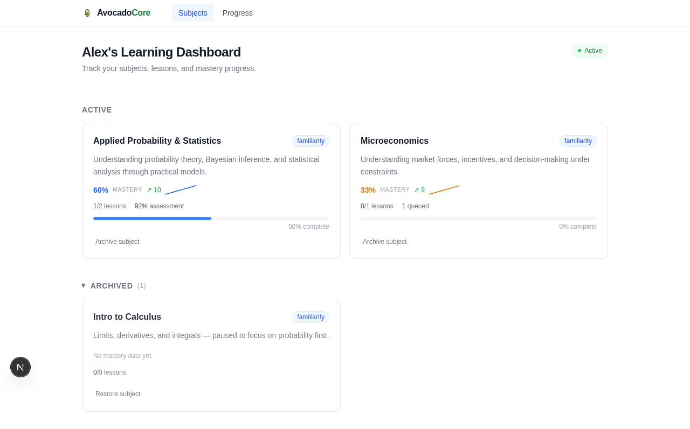

### Written text + media

The flagship Bayes lesson: first-class written teaching text (definition, worked example, callout, list) alongside a privacy-enhanced YouTube embed that degrades to a link if blocked.

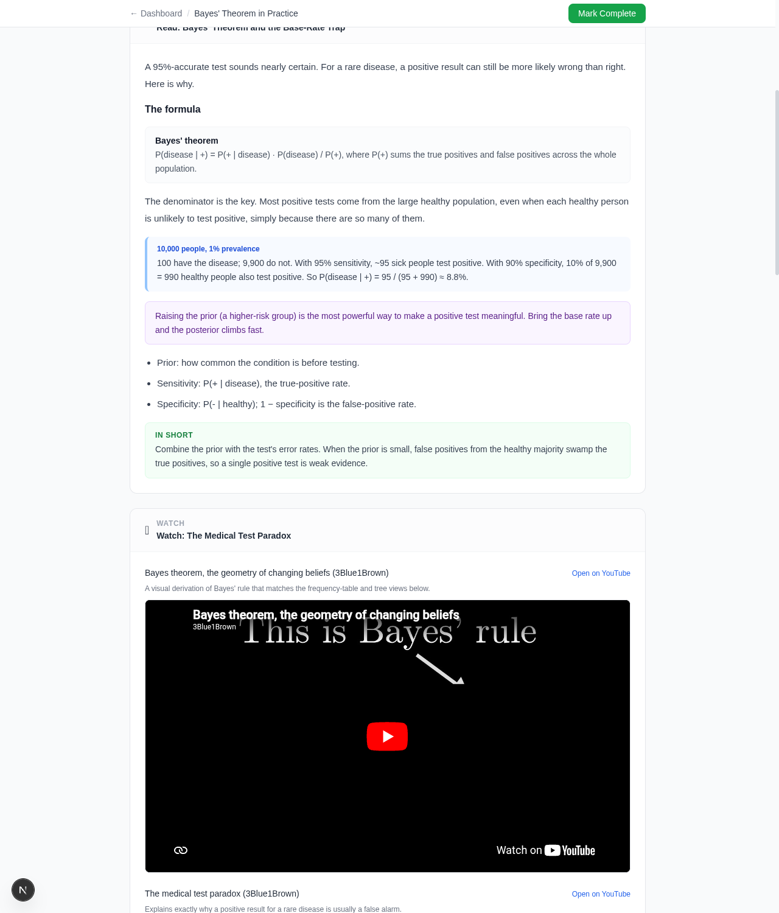

### Multiple visualizations for one concept

One declarative widget, one slider set, three live views — a bar chart, a frequency table, and a population tree — plus an explanatory panel.

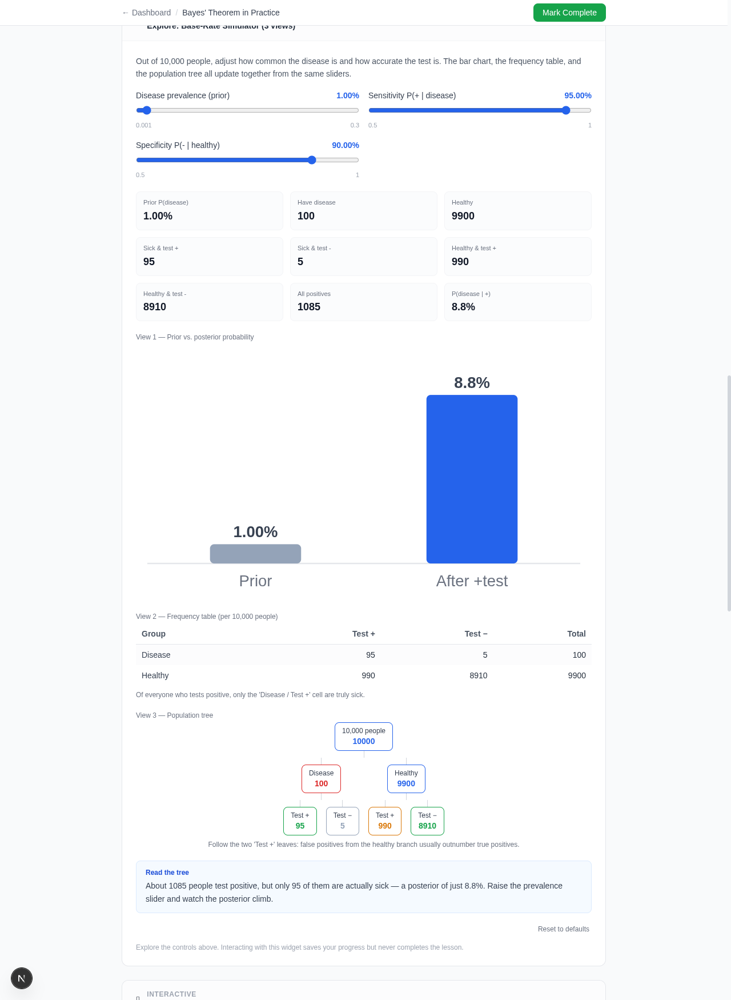

### Code submission workflow

Before submit: task, constraints, guided steps, progressive hints, starter code, public tests pending, and "3 hidden tests · run on submit". Later hints can reach the full answer explanation if the learner keeps opening them. After submit: hints revealed, all public + hidden tests green, and "Solution accepted" — the lesson stays in progress (manual completion only).

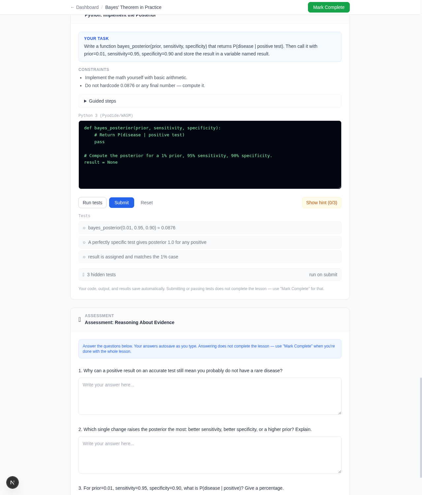
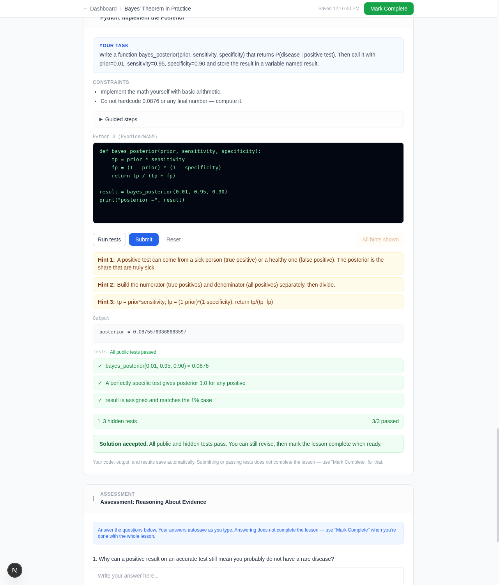

### Per-subject mastery

The Mastery tab leads with a score dial, sparkline, trend explanation, and signal counts. (The "Ready to advance" signal here is the recorded code submission.)

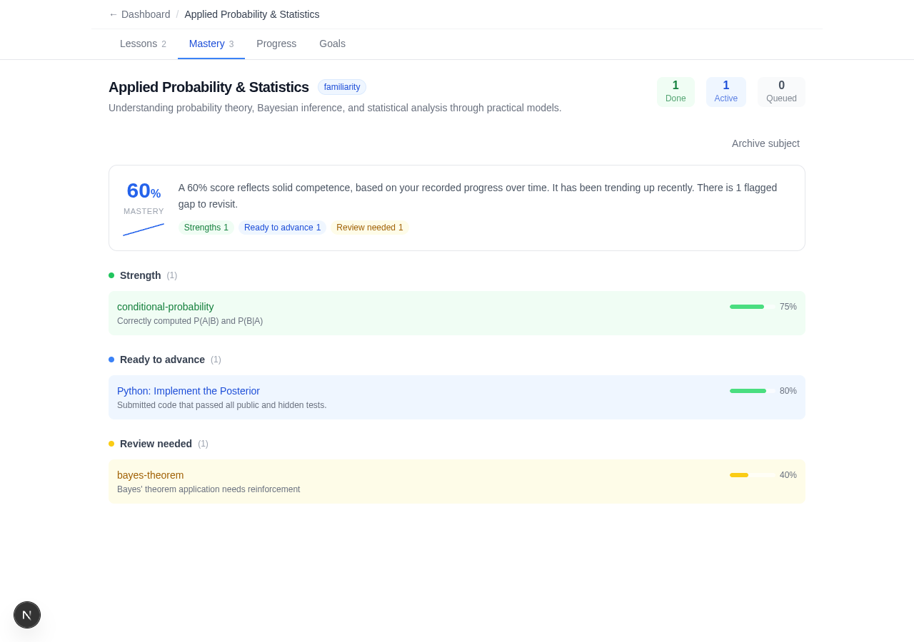

### Mobile (390px)

No page-level horizontal scrolling; outputs and visualizations reflow.

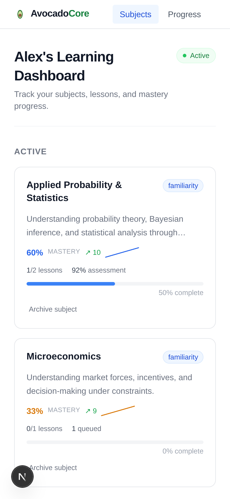
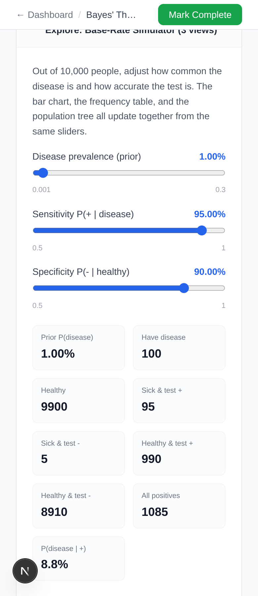

---

## Adaptive multiple-choice quiz (2026-06-22)

Commit `238dbeb`. Adds the full adaptive MC assessment system on top of the existing freeform assessment section.

### New files

| File | Purpose |
|------|---------|
| `src/lib/quiz-state.ts` | Pure state machine: queue, grading, pass logic, retry scheduling, autosave serialization |
| `src/lib/acp-rephrase.ts` | Client-side fire-and-forget rephrase request adapter |
| `src/app/api/rephrase-question/route.ts` | Server handler: calls `AVOCADOCORE_ACP_ENDPOINT` (OpenAI-compat), validates output, falls back to deterministic shuffler |
| `src/components/lesson/MultipleChoiceAssessmentSection.tsx` | One-question-at-a-time quiz UI, keyboard-accessible, progress bar, retry badge |
| `src/test/quiz.test.ts` | 57 new tests (169 total) |

### Key behaviour verified

- One question rendered at a time; Submit locks choices; correct/incorrect feedback shown with explanation; Next required to advance (no auto-advance)
- Pass requires 6 distinct correct concepts; missed concept requeued as retry; retry cleared only on correct retry answer
- Deterministic fallback retry shuffles choices via seeded Fisher-Yates so the UI is never blocked waiting for ACP
- ACP rephrase fires asynchronously after a wrong answer; result integrated when retry reaches front of queue
- Autosave writes quiz state under `__quiz__` key in `assessment_answers`; page reload restores full state including retry queue and feedback
- Mark Complete gated until `quizPassed === true`; lesson does NOT auto-complete on quiz pass

### Screenshots

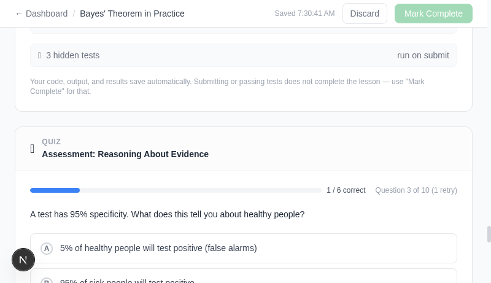

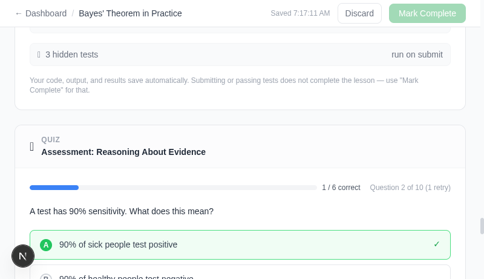

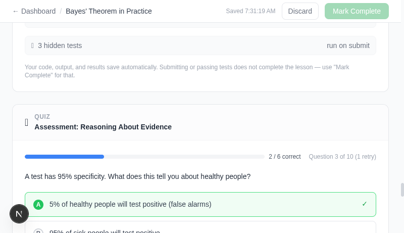

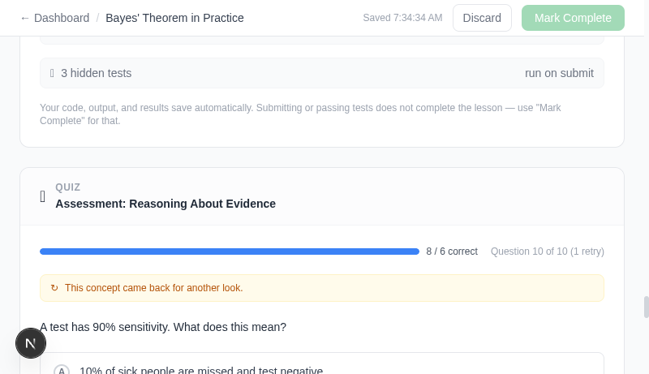

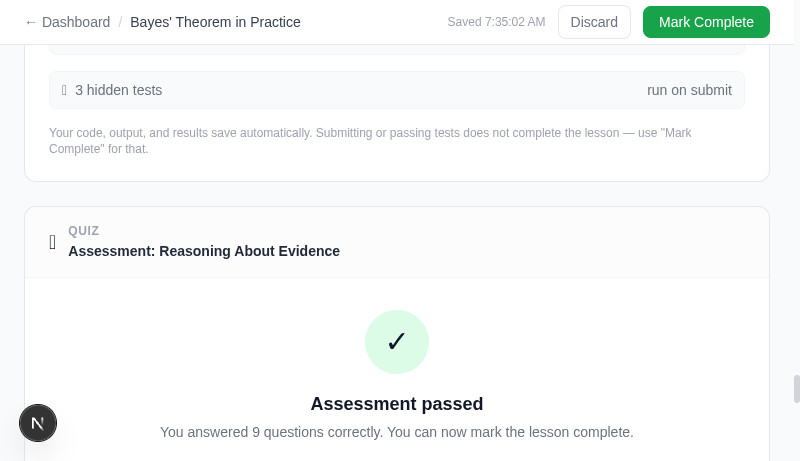

---

## Verification (adaptive MC quiz — 2026-06-22)

| Check | Result |
|-------|--------|
| `pnpm test` (Vitest) | 169/169 passing (57 new quiz tests) |
| `pnpm exec tsc --noEmit` | Clean |
| `pnpm lint` | No warnings or errors |
| Unanswered question renders (browser) | Question text + 4 radio choices + disabled Submit shown |
| Correct feedback (browser) | Answer locked, correct choice highlighted green ✓, explanation shown, Next required |
| Incorrect feedback (browser) | Answer locked, wrong choice highlighted red ✗, correct answer shown, explanation, retry notice |
| Retry scheduling (browser) | Wrong answer on Q2 → "(1 retry)" badge; Q10 shows "↻ This concept came back for another look." with shuffled choices |
| Passed state (browser) | After 6 correct (plus retry obligation cleared), "Assessment passed" screen shown, 9/6 correct displayed |
| No auto-completion (live API) | Lesson status remained `in_progress` after quiz passed; Mark Complete button enabled but not auto-clicked |
| Autosave `__quiz__` key (live API) | `GET /api/lessons/2` autosave row confirmed has `__quiz__` in `assessment_answers` |
| Mark Complete gated (browser) | Button had `disabled` + tooltip "Pass the quiz first (6 correct answers required)" before quiz passed; enabled after pass |

---

## Verification (richer-lessons pass — 2026-06-20)

| Check | Result |
|-------|--------|
| `pnpm test` (Vitest) | 65/65 passing |
| `pnpm exec tsc --noEmit` | Clean |
| `pnpm lint` | No warnings or errors |
| `pnpm build` | Compiles; `/icon.svg` route emitted |
| Written text + media (browser) | Reading blocks render; YouTube embed loads from `youtube-nocookie.com`; fallback link present |
| Multiple visualizations (browser) | Bayes widget shows bar + frequency table + tree from one slider set; second posterior-curve widget; no horizontal scroll |
| Code submission (browser) | Run/Submit/hints work; Pyodide executed; 3 public + 3 hidden tests passed; "Solution accepted"; answer path can be progressively revealed through hints |
| No auto-completion (live API) | Lesson 2 stayed `in_progress` after audio/reading/media/widget/code interaction + a passing submission |
| Code submission → mastery (live) | Passing submit recorded a `ready_to_advance` signal; lesson not completed |
| Archive round-trip (live API) | Restore set `status=active`/`archived_at=NULL`; re-archive set `status=archived`/`archived_at` stamped; no data deleted |
| Per-subject mastery (live API) | Scores computed (60 up, 33 up); archived subject reports no mastery data |
| Mobile 390px | `horizontalOverflowPx=0` on dashboard and multi-viz |

### MVP verification (prior pass — 2026-06-20)

| Check | Result |
|-------|--------|
| `pnpm test` (Vitest) | 41/41 passing |
| `pnpm exec tsc --noEmit` | Clean |
| `pnpm lint` | No warnings or errors |
| `git ls-files` privacy scan | No DB / audio / `.env` / secrets / Discord IDs tracked; runtime `data/*.db` gitignored |
| Autosave vs completion (live API) | `POST /api/autosave` left lessons unchanged; only `POST /api/complete-lesson` triggers completion |
| Widget autosave (live DB) | `lesson_autosave.widget_state` correctly saved slider values for both widget types after interaction |
| Widget no-complete invariant | Lesson 3 remained `queued`/`in_progress` after all widget interactions; lesson 1 `completed` unchanged |
| Bayes widget live | Sliders rendered, outputs updated (prior slider moved 10.1%→9.8%, posterior 51.6%→50.8%), chart redrawn |
| Supply-demand widget live | Sliders rendered, $15 tax shifted equilibrium $28.57→$37.14, quantity 57.1→44.3, tax revenue $664 shown |
| Autosave restore | Supply-demand page reload restored saved tax=15 from `widget_state` |
| React error check | No `setState during render` warnings after fix to `update()` in both widget components |
| UI render | Dashboard, subject workspace, and lesson workspace all render with seed data |
| Multi-user schema | `users` → `learner_profiles` → `subjects` identity separation; no single-user hardcoding |

### Run locally

```bash
cd code/avocadocore
pnpm install
mkdir -p data
NODE_OPTIONS="--localstorage-file=/tmp/avocado-ls.json" pnpm db:migrate --seed
NODE_OPTIONS="--localstorage-file=/tmp/avocado-ls.json" pnpm dev --port 3456
# open http://localhost:3456
```

> Node.js 25 exposes a built-in `localStorage` global that conflicts with Next.js SSR; the `--localstorage-file` flag supplies a backing store. On Node 20–22 the flag is unnecessary.
